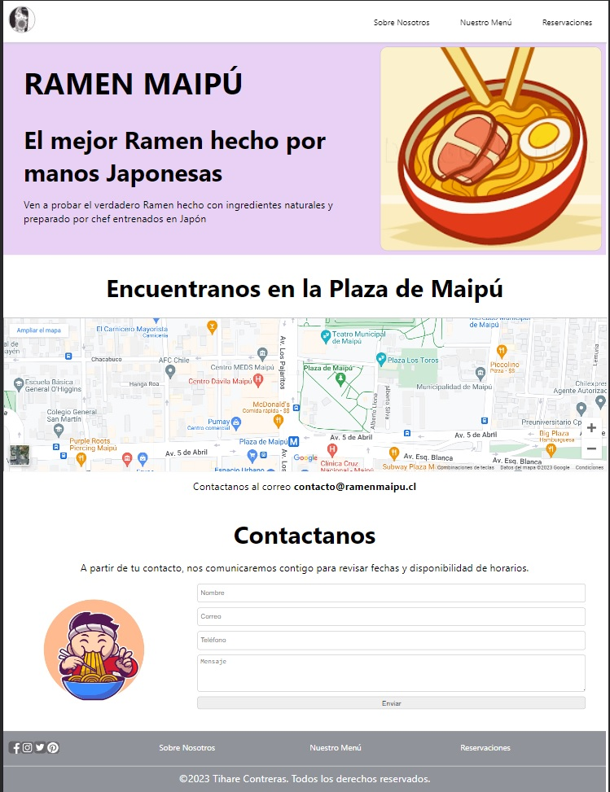

# PROYECTO 4: Aplicación "Restaurante"

## **ÍNDICE**

* [1. Intro](#1-intro)
* [2. Descripcion](#2-Descripción)

****

## 1. Intro
Cuarto proyecto realizado con React y usando el hook useState

****

## 2. Descripción
Se creo una aplicación de restaurant donde se crearon 5 secciones:

- Cabecera
- Información del restaurant
- Localizacion usando Google Maps
- Contacto usando un formulario y el hook useState
- Footer

****

